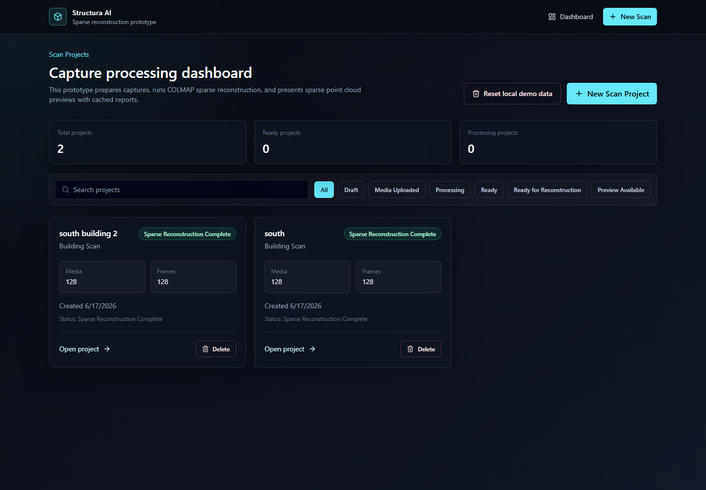
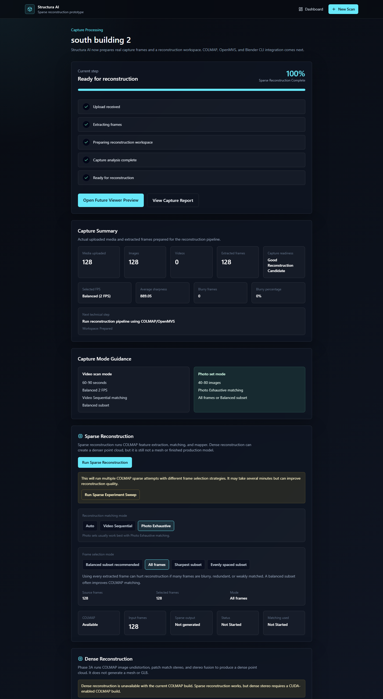
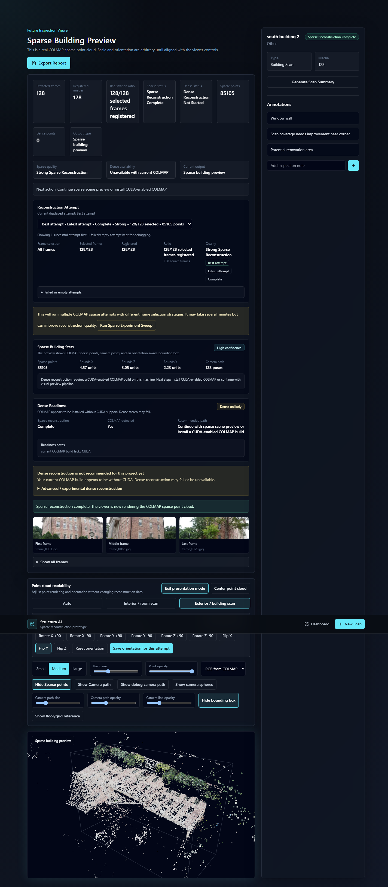
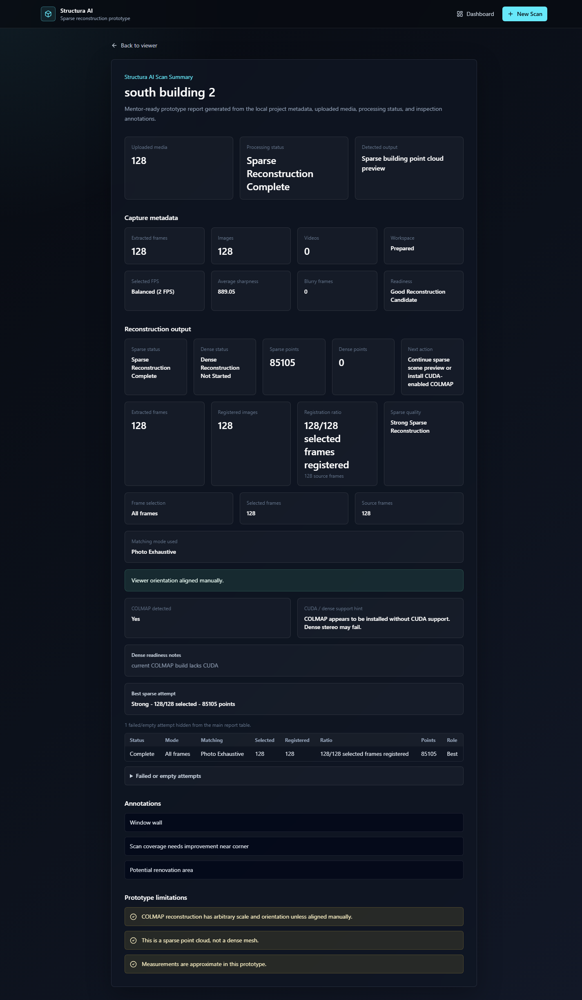

# Structura AI

Structura AI v0.1 is a local capture-to-reconstruction prototype: upload photos or video, prepare frames, run COLMAP sparse reconstruction, track attempts, choose the best result, view a sparse building point cloud, and generate a cached scan report. The current demo proves a practical sparse reconstruction workflow without claiming a finished dense mesh or production inspection model.

## Demo Result

**South Building demo: 128/128 registered images, 85k sparse points**

- Dataset style: exterior/building photo set
- Matching mode: `Photo Exhaustive`
- Frame selection: `All frames`
- Sparse points: `85,105`
- Sparse quality: `Strong Sparse Reconstruction`
- Viewer mode: `Exterior / building scan`
- Recommended demo view: `Presentation mode`

## Demo Screenshots









## v0.1 Sparse Reconstruction Demo

- Local photo/video capture pipeline
- COLMAP sparse reconstruction
- Best attempt tracking
- Exterior building viewer
- Cached scan reports
- South Building result: `128/128 registered images, 85,105 sparse points`

This version produces sparse point cloud previews, not dense meshes or textured 3D models yet.

## Roadmap

- v0.1 Sparse reconstruction demo
- v0.2 Visual Preview foundation
- v0.2 Visual Preview training adapter with Nerfstudio Splatfacto
- Planned: Dense geometric reconstruction
- Planned: Reference vs Current comparison

## v0.2 Visual Preview Training Adapter

Visual Preview can prepare a Nerfstudio dataset from Structura's best COLMAP sparse attempt and launch Nerfstudio Splatfacto as an external training tool.

- Requires Nerfstudio/Splatfacto installed outside Structura.
- Uses Structura COLMAP sparse output and registered images.
- Produces a Gaussian Splat export only when Nerfstudio training and export succeed.
- It is not a dense mesh.
- It is not used for progress measurement yet.
- In-browser splat rendering is a later milestone.

Optional environment variables:

```powershell
$env:NERFSTUDIO_PYTHON="C:\path\to\python.exe"
$env:NERFSTUDIO_NS_TRAIN="C:\path\to\ns-train.exe"
$env:NERFSTUDIO_NS_EXPORT="C:\path\to\ns-export.exe"
```

Windows setup helper:

```powershell
.\scripts\setup_nerfstudio_windows.ps1
```

On Windows, Splatfacto CUDA extension builds need the VS 2022 Build Tools C++ workload, CUDA 11.8 conda build packages, and a local CUDA 11.8 CUB header patch for the Windows SDK `small` macro collision. The setup helper applies the conda/package/header parts; install VS 2022 Build Tools first if `vcvars64.bat` is missing:

```powershell
winget install --id Microsoft.VisualStudio.2022.BuildTools --exact --silent --accept-package-agreements --accept-source-agreements
```

Known-good local paths after the helper installs Miniconda:

```powershell
$env:NERFSTUDIO_PYTHON="C:\Users\serfu\miniconda3\envs\nerfstudio\python.exe"
$env:NERFSTUDIO_NS_TRAIN="C:\Users\serfu\miniconda3\envs\nerfstudio\Scripts\ns-train.exe"
$env:NERFSTUDIO_NS_EXPORT="C:\Users\serfu\miniconda3\envs\nerfstudio\Scripts\ns-export.exe"
```

Visual Preview flow:

1. Run a successful sparse reconstruction and keep the best attempt selected.
2. Open Visual Preview and confirm diagnostics show Nerfstudio, `ns-train`, `ns-export`, and CUDA available.
3. Prepare the visual preview manifest. Structura creates `nerfstudio_dataset/images/` and `nerfstudio_dataset/sparse/0/`.
4. Train with Splatfacto from the Visual Preview page or API. Use `smoke` only to validate the pipeline, `demo` for portfolio screenshots, and `quality` when slower training is acceptable.
5. Export Gaussian Splat. Structura only marks export complete when a `.ply` file is produced.
6. Current limitation: browser Gaussian Splat rendering is pending; the exported `.ply` path and size are shown instead.

Training presets:

- `smoke`: 1 iteration, pipeline validation only.
- `quick`: 1000 iterations, fast preview.
- `demo`: 7000 iterations, recommended for meaningful portfolio screenshots.
- `quality`: 30000 iterations, slower but better.

## Features

- Photo/video capture upload
- FFmpeg-backed video frame extraction
- Uploaded photo normalization into reconstruction frames
- Frame selection modes: Balanced subset, All frames, Sharpest subset, Evenly spaced subset
- COLMAP sparse reconstruction
- Sparse reconstruction attempt tracking
- Best attempt scoring and default selection
- Sparse experiment sweep for comparing frame-selection strategies
- Visual Preview manifest preparation from strong or usable sparse attempts
- Nerfstudio Splatfacto training/export adapter for Visual Preview
- Exterior/building sparse point cloud viewer
- Manual viewer orientation save per attempt
- Presentation mode for clean demo screenshots
- Cached report generation that avoids reparsing large point clouds
- CUDA-aware dense readiness diagnostics
- Dense reconstruction endpoint kept available but de-emphasized when COLMAP lacks CUDA

## Honest Limitations

- Current output is a sparse point cloud preview.
- Visual Preview training requires Nerfstudio. Gaussian Splat output is available only after training and export succeed.
- In-browser Gaussian Splat rendering is not implemented yet.
- It is not a dense mesh yet.
- It is not a textured model yet.
- Scale and orientation are arbitrary unless aligned manually in the viewer.
- Measurements are approximate prototype values.
- Dense stereo reconstruction realistically requires a CUDA-enabled COLMAP build on this machine.
- Mesh generation, textured model export, and GLB export are future milestones.

## Local Setup

### Backend

```powershell
cd backend
python -m venv .venv
.\.venv\Scripts\python -m pip install -r requirements.txt
.\.venv\Scripts\python -m uvicorn app.main:app --reload --host 127.0.0.1 --port 8000
```

Backend URL: `http://127.0.0.1:8000`

Video frame extraction uses FFmpeg. The backend checks `ffmpeg` on PATH, then falls back to `imageio-ffmpeg` from `requirements.txt`.

### Frontend

```powershell
cd frontend
npm install
npm run dev
```

Frontend URL: `http://localhost:3000`

### COLMAP

Sparse reconstruction requires COLMAP on PATH or a configured COLMAP executable.

```powershell
colmap -h
Invoke-RestMethod http://127.0.0.1:8000/diagnostics
```

If diagnostics says COLMAP is installed `without CUDA`, sparse reconstruction can still work, but dense stereo may fail or be unavailable.

## Demo Flow

1. Start the backend and frontend.
2. Open `http://localhost:3000`.
3. Create a Building Scan project.
4. Upload the South Building photo set.
5. Process capture.
6. Run sparse reconstruction with `Photo Exhaustive` and `All frames`.
7. Open the viewer.
8. Select or confirm `Exterior / building scan`.
9. Align the sparse point cloud if needed and save the attempt orientation.
10. Enable `Presentation mode`.
11. Open the report.
12. Explain the result: `128/128 registered images, 85k sparse points`.
13. Open Visual Preview.
14. Confirm Nerfstudio diagnostics are green.
15. Prepare the South Building visual preview dataset from the best sparse attempt.
16. Train Splatfacto with the `demo` preset, then export the Gaussian Splat `.ply`.
17. Download `splat.ply` and open it in an external Gaussian Splat viewer such as SuperSplat or Polycam.

The Visual Preview export is a real Nerfstudio/Splatfacto artifact. Structura does not render Gaussian Splats internally yet; the browser renderer is pending and no fake preview is shown.

## API Validation Commands

```powershell
Invoke-RestMethod http://127.0.0.1:8000/health
Invoke-RestMethod http://127.0.0.1:8000/diagnostics
Invoke-RestMethod http://127.0.0.1:8000/projects
```

For a project:

```powershell
Invoke-RestMethod "http://127.0.0.1:8000/projects/$($project.id)/capture-summary"
Invoke-RestMethod "http://127.0.0.1:8000/projects/$($project.id)/reconstruction-summary"
Invoke-RestMethod "http://127.0.0.1:8000/visual-preview/diagnostics"
Invoke-RestMethod "http://127.0.0.1:8000/projects/$($project.id)/visual-preview-summary"
Invoke-RestMethod "http://127.0.0.1:8000/projects/$($project.id)/visual-preview/prepare" -Method Post
Invoke-RestMethod "http://127.0.0.1:8000/projects/$($project.id)/visual-preview/training-status"
Invoke-RestMethod "http://127.0.0.1:8000/projects/$($project.id)/visual-preview/splat-file/metadata"
Invoke-RestMethod "http://127.0.0.1:8000/projects/$($project.id)/report"
```

## Build Checks

```powershell
cd backend
.\.venv\Scripts\python -m compileall app

cd ..\frontend
npm run build
```

## Screenshots

Screenshot guidance is in `docs/SCREENSHOT_CHECKLIST.md`. Real screenshots should be saved under `docs/screenshots/`; no fake screenshots are included.
